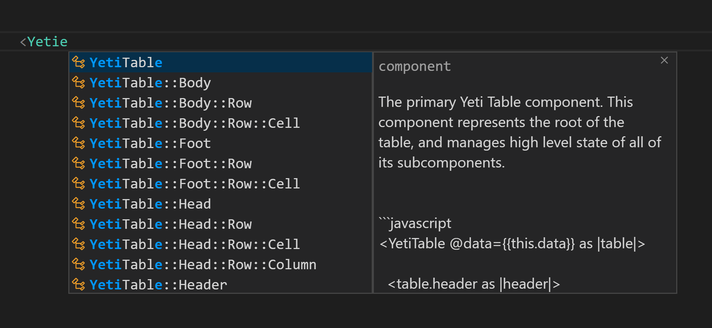
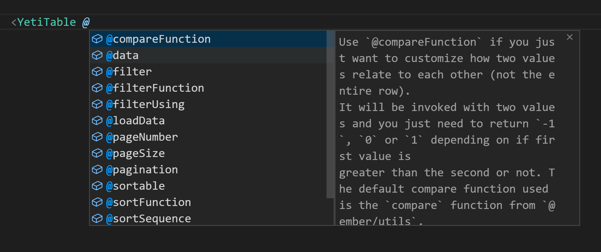
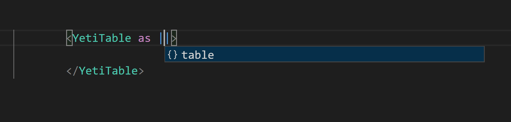
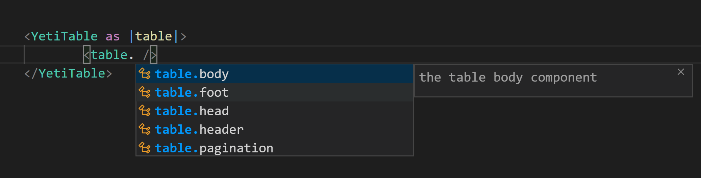

# els-addon-docs
Ember Language Server Addon Docs Completion Provider

How to use?

Install this addon as `dev-dependency` inside your ember project.

### Component information

### Argument information

### Block params autocomplete

### Yielded values autocomplete

### Features

* component desciption (from `ember-cli-addon-docs`)
* component block params autocomplete

### NPM
`npm install els-addon-docs --save-dev`

### Yarn
`yarn add els-addon-docs --dev`

### VSCode

Install: [Unstable Ember Language Server](https://marketplace.visualstudio.com/items?itemName=lifeart.vscode-ember-unstable).

* Restart `VSCode`.

## Usage

`*` you have to have installed addons, having public documentation page, created by `ember-cli-addon-docs`.

For example:

* [ember-flatpickr](https://shipshapecode.github.io/ember-flatpickr/)
* [ember-yeti-table](https://miguelcobain.github.io/ember-yeti-table/)
* [ember-file-upload](https://adopted-ember-addons.github.io/ember-file-upload/)

[and others](https://github.com/ember-learn/ember-cli-addon-docs/network/dependents?package_id=UGFja2FnZS01MTIzMzk3Mg%3D%3D)

Install `els-addon-docs` as `dev-dependency` in your porject.
Restart editor.

Try type `<` inside component template.

## Is it stable?

* sometimes it may crash your language server, don't worry.
